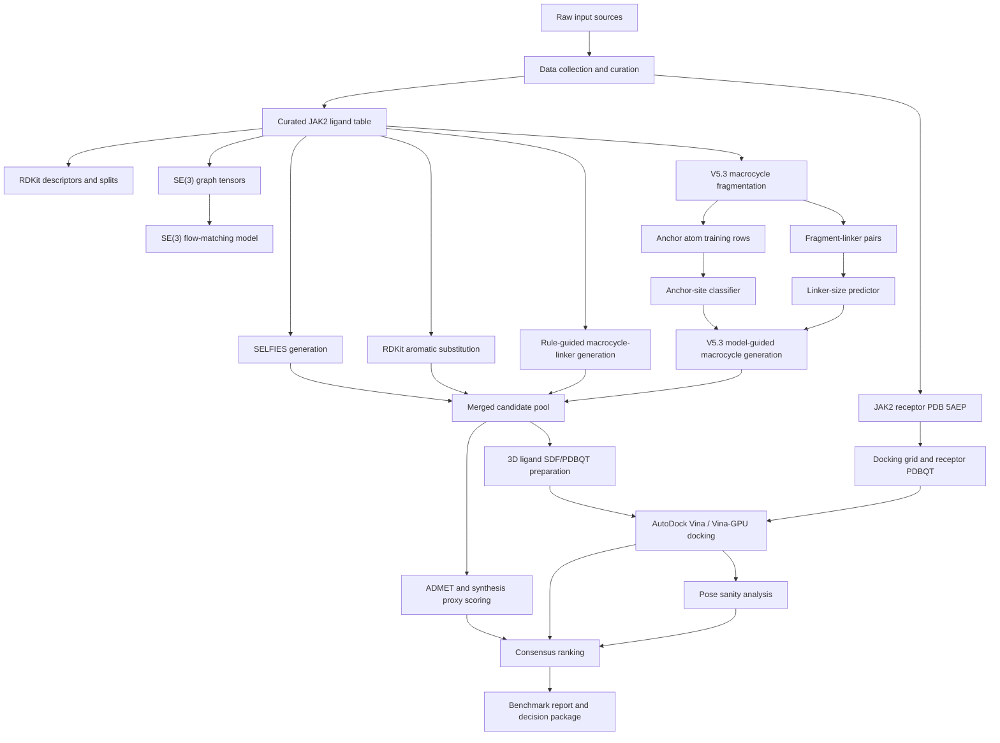
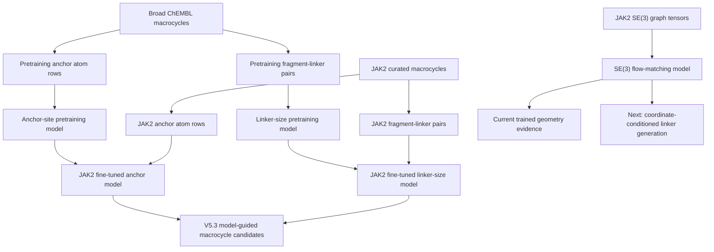
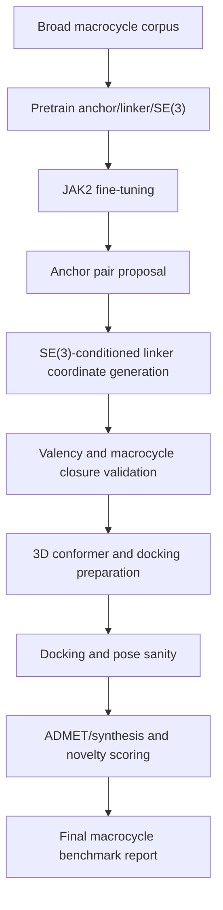

# ElectroMacroDiff V5.3 Project Architecture And Model Flow

Generated: 2026-05-11

Updated through: 2026-05-14

Project root:

`C:\Users\srira\Desktop\new_plan\EMD_V5_2_Hybrid`

This document explains the full architecture of the ElectroMacroDiff V5.2/V5.3 Hybrid project: the original plan, what has already been implemented, the input and output flow through every major module, which pretrained models are being used, which models were fine-tuned, what new models were added, where the model files are stored, which metrics we currently have, and what should happen next.

Important boundary: this project is a computational drug-discovery and prioritization pipeline. It proposes molecules for future experimental testing. It does not prove biological potency, clinical safety, human efficacy, FDA readiness, or synthesis success.

## 1. High-Level Goal

The project goal is to build a reproducible AI-assisted pipeline for JAK2 inhibitor discovery, with special emphasis on constrained and macrocyclic candidates.

The pipeline combines:

- Target-specific JAK2 ligand curation from ChEMBL.
- PDB-based receptor preparation using JAK2 structure `5AEP`.
- RDKit descriptor and graph feature generation.
- SE(3)-aware molecular geometry training.
- Baseline candidate generation using SELFIES and RDKit transformations.
- Macrocycle-specific rule-guided linker generation.
- V5.3 learned anchor-site and linker-size models.
- V5.3 model-guided macrocycle generation.
- Vina-GPU 2.1 docking for the V5.3 model-guided branch.
- Pocket/electronic-fit scoring using receptor/ligand PDBQT partial charges, contact geometry, hydrogen-bond opportunities, hydrophobic packing, aromatic contacts, and clash penalties.
- ADMET, synthesis, docking, pose sanity, final ranking, benchmark, decision-package, and audit outputs.

The central upgrade from V5.2 to V5.3 is the move from mostly rule-guided macrocycle generation toward learned macrocycle design:

- Learn which atoms are likely cyclization anchors.
- Learn appropriate linker sizes for macrocycle closure.
- Use those trained models to guide macrocycle construction.
- Later connect the SE(3) model more directly to linker geometry and pose-aware generation.
- V5.4 direction: close the loop so pocket/electronic-fit scores guide the next anchor/linker generation cycle instead of appearing only after docking.

## 2. Current Architecture Diagram



## 3. Model Training And Fine-Tuning Flow



## 4. Project Folder Architecture

| Folder | Role | Main outputs |
|---|---|---|
| `00_project_registry/` | Run registry, artifact registry, validation reports, progress JSON files. | `run_registry.csv`, `artifact_registry.csv`, `validation_report.json`, progress files. |
| `01_raw_data/` | Raw scientific inputs. | ChEMBL pulls, PDB `5AEP.pdb`, future BindingDB/PubChem/literature files. |
| `02_curated_data/` | Cleaned molecular tables and macrocycle datasets. | `jak2_curated_ligands.csv`, V5.3 macrocycle and fragment-linker CSVs. |
| `03_features/` | Molecular descriptors, graph tensors, anchor rows, conformer-ready features. | `ligand_features.csv`, `se3_graphs.pt`, `v5_3_anchor_atom_training.csv`. |
| `04_models_checkpoints/` | All trained model checkpoints, logs, summaries, curves. | SE(3), anchor-site, and linker-size model checkpoints. |
| `05_generated_candidates/` | Candidate molecule CSVs from each generation branch. | SELFIES, RDKit, macrocycle-linker, model-guided macrocycles, merged pools. |
| `06_docking/` | Docking receptor, ligand files, Vina/Vina-GPU outputs, poses, pose sanity files. | Receptor PDBQT, ligand PDBQT, Vina logs, Vina-GPU scores, poses, pose sanity scores. |
| `07_admet_synthesis/` | ADMET and synthesis proxy scores. | `admet_scores.csv`, `filter_flags.csv`, `safety_proxy_notes.csv`. |
| `08_final_ranking/` | Ranked candidates and final shortlist artifacts. | `final_ranked_candidates.csv`, top molecule SDF outputs. |
| `09_reports/` | Report package and rendered molecule assets. | Final report drafts, molecule images, TPP, audit summaries, V5.3 benchmark report, V5.3 GPU decision package. |
| `10_notebooks/` | Colab-ready notebooks created from script workflow. | Stage notebooks from environment setup to final ranking. |
| `11_logs/` | Daily and AI assistance logs. | `daily_log_template.md`, `ai_assistance_notes.md`. |
| `docs/` | Project documentation, plans, contracts, status. | Current status, Colab plans, artifact contracts, this architecture document. |
| `scripts/` | Command-line stage runners. | `01_collect_data.py` through `19_build_v5_3_gpu_decision_package.py`. |
| `src/emd_v5_2_hybrid/` | Reusable library modules. | Chemistry, model, training, generation, docking, ranking, reporting modules. |
| `tests/` | Lightweight validation tests. | `test_core.py`. |
| `tools/` | External executables. | AutoDock Vina executable. |

## 5. Stage-By-Stage Flow: Inputs, Modules, Models, Outputs

| Stage | Script | Main module(s) | Inputs | Outputs |
|---|---|---|---|---|
| M0 environment/project setup | `scripts/00_initialize_project.py` | `registry.py`, `schemas.py` | Empty or existing project root. | Folder tree, registry CSVs, environment report. |
| M1 data collection | `scripts/01_collect_data.py` | `data_collection.py`, `chemistry.py` | ChEMBL API, JAK2 target query, PDB `5AEP`. | `02_curated_data/jak2_curated_ligands.csv`, raw ChEMBL table, `01_raw_data/pdb/5AEP.pdb`. |
| M2 feature building | `scripts/02_build_features.py` | `features.py`, `se3_dataset.py`, `chemistry.py` | Curated ligand CSV. | Descriptor table, SE(3) graph tensor file, graph index. |
| M3 SE(3) debug/training | `scripts/03_debug_se3_training.py`, `scripts/03_train_se3_main.py` | `se3_flow.py`, `train_se3.py`, `se3_dataset.py` | SE(3) graph tensors. | SE(3) checkpoints, training logs, loss summaries. |
| M4 baseline generation | `scripts/04_generate_baselines.py` | `baseline_generation.py`, `generation_metrics.py` | Top JAK2 seed ligands. | SELFIES candidates, RDKit candidates, macrocycle-linker candidates, merged candidate CSV. |
| M5 docking prep and Vina | `scripts/06_prepare_docking_inputs.py`, `06_prepare_pdbqt.py`, `06_make_vina_manifest.py`, `06_run_vina_manifest.py`, `06_parse_vina_results.py` | `docking.py`, `docking_prep.py` | Ranked/candidate molecules, `5AEP.pdb`, Vina. | SDF, PDBQT, Vina command manifest, Vina logs, parsed docking scores. |
| M6 ADMET/synthesis proxy | `scripts/05_score_admet_synthesis.py` | `admet_synthesis.py`, `chemistry.py` | Merged candidates. | ADMET/synthesis/safety proxy CSVs. |
| M7 ranking | `scripts/07_rank_candidates.py` | `ranking.py` | Candidates, docking scores, ADMET scores, pose sanity data. | `08_final_ranking/final_ranked_candidates.csv`. |
| M8 reporting and audit | `scripts/09_*`, `scripts/10_*`, `scripts/11_*`, `scripts/12_*` | `reporting.py`, `pose_analysis.py`, `validation.py` | Ranked outputs and all registries. | Reports, molecule images, audit summaries, validation report. |
| V5.3 dataset build | `scripts/13_build_v5_3_fragment_dataset.py` | `macrocycle_fragmentation.py` | Broad macrocycle CSV or JAK2 curated ligand CSV. | Fragment-linker pairs and anchor atom training rows. |
| V5.3 anchor training | `scripts/14_train_v5_3_anchor_model.py` | Torch MLP in training script. | Anchor atom training CSV. | Anchor-site classifier checkpoint and metrics. |
| V5.3 linker-size training | `scripts/15_train_v5_3_linker_size_model.py` | Torch MLP in training script. | Fragment-linker pair CSV. | Linker-size predictor checkpoint and metrics. |
| V5.3 broad macrocycle collection | `scripts/16_collect_macrocycle_pretraining_data.py` | `data_collection.py`, `chemistry.py` | ChEMBL scan. | Broad macrocycle pretraining CSV. |
| V5.3 model-guided generation | `scripts/17_generate_v5_3_model_guided_macrocycles.py` | Anchor model, linker model, `baseline_generation.py`, `generation_metrics.py` | JAK2 seeds, fine-tuned anchor model, fine-tuned linker-size model. | V5.3 model-guided macrocycle CSV, merged candidate pool with V5.3 branch. |
| V5.3 benchmark report | `scripts/18_build_v5_3_benchmark_report.py` | `benchmarking.py`, registry helpers | Candidate, docking, and pose CSVs. | V5.3 benchmark markdown, metrics CSVs, summary JSON. |
| V5.3 GPU decision package | `scripts/19_build_v5_3_gpu_decision_package.py` | RDKit rendering, registry helpers | V5.3 GPU ranking, docking scores, pose sanity scores. | Top-candidate CSV, decision markdown, molecule images, package zip. |

## 6. Data Assets And Current Counts

| Data asset | Current count | File |
|---|---:|---|
| Curated JAK2 ligands | `1,135` molecules | `02_curated_data/jak2_curated_ligands.csv` |
| Real JAK2 macrocycles inside curated set | `97` molecules | `02_curated_data/jak2_curated_ligands.csv` |
| Broad macrocycle pretraining molecules | `1,745` molecules | `02_curated_data/v5_3_pretrain_macrocycles.csv` |
| Broad macrocycle fragment-linker pairs | `52,266` rows | `02_curated_data/v5_3_pretrain_fragment_linker_pairs.csv` |
| Broad macrocycle anchor atom rows | `2,642,513` rows | `03_features/v5_3_pretrain_anchor_atom_training.csv` |
| JAK2 macrocycle fragment-linker pairs | `2,942` rows | `02_curated_data/v5_3_macrocycle_fragment_linker_pairs.csv` |
| JAK2 anchor atom rows | `94,247` rows | `03_features/v5_3_anchor_atom_training.csv` |
| JAK2 SE(3) graph examples | `1,135` graphs | `03_features/ligand_graphs/se3_graphs.pt` and `se3_graph_index.csv` |
| Original merged generated candidates | `6,774` molecules | `05_generated_candidates/merged/generated_merged_filtered.csv` |
| V5.3 model-guided macrocycles | `114` molecules | `05_generated_candidates/model_guided_macrocycle/generated_v5_3_model_guided_macrocycles.csv` |
| Merged pool with V5.3 branch | `6,888` molecules | `05_generated_candidates/merged/generated_merged_with_v5_3_model_guided.csv` |
| Parsed Vina scores from current V5.2 docking campaign | `148` candidates | `06_docking/scores/docking_scores.csv` |
| Prepared V5.3 model-guided ligand PDBQT files | `114` candidates | `06_docking/v5_3_model_guided/ligands_pdbqt/` |
| Vina-GPU-safe V5.3 ligand PDBQT files | `114` candidates | `06_docking/v5_3_model_guided/ligands_pdbqt_vina_gpu_clean/` |
| Parsed V5.3 Vina-GPU 2.1 docking scores | `114 / 114` candidates | `06_docking/v5_3_model_guided/scores/docking_scores_full_vina_gpu_2_1.csv` |
| Normalized V5.3 Vina-GPU poses | `114` poses | `06_docking/v5_3_model_guided/poses/` |
| Raw V5.3 Vina-GPU poses | `114` poses | `06_docking/v5_3_model_guided/poses_gpu_raw/` |
| V5.3 pose sanity checks | `10 / 10` pass | `06_docking/v5_3_model_guided/scores/pose_sanity_scores.csv` |
| V5.2 campaign final ranking table | `6,774` candidates | `08_final_ranking/final_ranked_candidates.csv` |
| V5.3 model-guided ranking table | `114` candidates | `08_final_ranking/v5_3_model_guided_ranked_candidates.csv` |
| V5.3 GPU decision package | `10` top candidates | `09_reports/v5_3_gpu_decision_package/` |

## 7. Model Inventory And Exact File Locations

All model checkpoints live under:

`C:\Users\srira\Desktop\new_plan\EMD_V5_2_Hybrid\04_models_checkpoints`

### 7.1 SE(3) Flow-Matching Model

Purpose:

- Learns molecular coordinate/geometry flow from graph tensors.
- Provides the project with an SE(3)-aware learned geometry model.
- Current V5.3 model-guided macrocycle generation does not yet directly sample linker coordinates from this model. It is trained evidence and the next target for deeper integration.

Architecture:

- Compact fully connected SE(3)-aware flow-matching network.
- Uses atom features, coordinates, time embedding, pairwise coordinate differences, invariant scalar edge weights, and equivariant coordinate velocity updates.
- Implemented in `src/emd_v5_2_hybrid/se3_flow.py`.

Training input:

- `03_features/ligand_graphs/se3_graphs.pt`
- `03_features/ligand_graphs/se3_graph_index.csv`

Current training metrics:

| Metric | Value |
|---|---:|
| Device used in imported training | `cuda` |
| Total graphs | `1,135` |
| Train graphs | `794` |
| Validation graphs | `170` |
| Held-out test graphs | `171` |
| Epochs | `50` |
| Batch size | `8` |
| Hidden dim | `128` |
| Layers | `4` |
| Learning rate | `0.0002` |
| Best validation loss | `9.0621` |
| Final train loss | `9.6517` |
| Final validation loss | `9.8762` |

Model files:

| File | Purpose | Absolute location |
|---|---|---|
| `se3_best_checkpoint.pt` | Best validation checkpoint. | `C:\Users\srira\Desktop\new_plan\EMD_V5_2_Hybrid\04_models_checkpoints\se3_flow\se3_best_checkpoint.pt` |
| `se3_latest_checkpoint.pt` | Latest checkpoint. | `C:\Users\srira\Desktop\new_plan\EMD_V5_2_Hybrid\04_models_checkpoints\se3_flow\se3_latest_checkpoint.pt` |
| `training_log.csv` | Per-epoch training log. | `C:\Users\srira\Desktop\new_plan\EMD_V5_2_Hybrid\04_models_checkpoints\se3_flow\training_log.csv` |
| `training_curve.png` | Training curve image. | `C:\Users\srira\Desktop\new_plan\EMD_V5_2_Hybrid\04_models_checkpoints\se3_flow\training_curve.png` |
| `training_summary.json` | Summary metrics. | `C:\Users\srira\Desktop\new_plan\EMD_V5_2_Hybrid\04_models_checkpoints\se3_flow\training_summary.json` |
| `se3_dataloader_test_passed.json` | Dataloader/debug gate proof. | `C:\Users\srira\Desktop\new_plan\EMD_V5_2_Hybrid\04_models_checkpoints\se3_flow\se3_dataloader_test_passed.json` |

SE(3) pretraining status:

- Directory exists: `04_models_checkpoints/se3_flow_pretrain/`.
- No current SE(3) pretraining checkpoint files were found in that folder after the latest local merge.
- Current usable SE(3) checkpoint is the trained/fine-tuned JAK2 checkpoint under `04_models_checkpoints/se3_flow/`.
- Next upgrade should add a real broad macrocycle SE(3) pretrain checkpoint, then fine-tune it on JAK2 graph tensors.

### 7.2 V5.3 Anchor-Site Classifier

Purpose:

- Predicts whether an atom is a good macrocycle cyclization anchor.
- Used by V5.3 model-guided generation to select anchor atoms before linker construction.

Model type:

- Torch multilayer perceptron.
- Input dimension: `10` atom-level features.
- Hidden dimension: `192`.
- Output: binary anchor probability.
- Implemented in `scripts/14_train_v5_3_anchor_model.py`.
- Loaded and used by `scripts/17_generate_v5_3_model_guided_macrocycles.py`.

Input features:

- `atomic_num`
- `degree`
- `formal_charge`
- `is_aromatic`
- `is_ring`
- `total_h`
- `hybridization_sp`
- `hybridization_sp2`
- `hybridization_sp3`
- `mass`

Pretraining:

| Field | Value |
|---|---:|
| Input | `03_features/v5_3_pretrain_anchor_atom_training.csv` |
| Rows | `2,642,513` |
| Epochs | `1,000` |
| Hidden dim | `192` |
| Learning rate | `0.0005` |
| Best epoch | `117` |
| Selected threshold | `0.70` |
| Validation F1 | `0.1742` |
| Test F1 | `0.1697` |
| Test precision | `0.0968` |
| Test recall | `0.6871` |

Fine-tuning:

| Field | Value |
|---|---:|
| Input | `03_features/v5_3_anchor_atom_training.csv` |
| Initialized from | `04_models_checkpoints/v5_3_anchor_pretrain/anchor_site_model.pt` |
| Rows | `94,247` |
| Epochs | `500` |
| Hidden dim | `192` |
| Learning rate | `0.0002` |
| Best epoch | `369` |
| Selected threshold | `0.65` |
| Validation F1 | `0.2069` |
| Test F1 | `0.2089` |
| Test precision | `0.1287` |
| Test recall | `0.5547` |

Model files:

| Model stage | File | Absolute location |
|---|---|---|
| Anchor pretrain checkpoint | `anchor_site_model.pt` | `C:\Users\srira\Desktop\new_plan\EMD_V5_2_Hybrid\04_models_checkpoints\v5_3_anchor_pretrain\anchor_site_model.pt` |
| Anchor pretrain log | `anchor_training_log.csv` | `C:\Users\srira\Desktop\new_plan\EMD_V5_2_Hybrid\04_models_checkpoints\v5_3_anchor_pretrain\anchor_training_log.csv` |
| Anchor pretrain summary | `anchor_training_summary.json` | `C:\Users\srira\Desktop\new_plan\EMD_V5_2_Hybrid\04_models_checkpoints\v5_3_anchor_pretrain\anchor_training_summary.json` |
| Anchor fine-tuned checkpoint | `anchor_site_model.pt` | `C:\Users\srira\Desktop\new_plan\EMD_V5_2_Hybrid\04_models_checkpoints\v5_3_anchor\anchor_site_model.pt` |
| Anchor fine-tuned log | `anchor_training_log.csv` | `C:\Users\srira\Desktop\new_plan\EMD_V5_2_Hybrid\04_models_checkpoints\v5_3_anchor\anchor_training_log.csv` |
| Anchor fine-tuned summary | `anchor_training_summary.json` | `C:\Users\srira\Desktop\new_plan\EMD_V5_2_Hybrid\04_models_checkpoints\v5_3_anchor\anchor_training_summary.json` |

How it is used now:

- The V5.3 generation script loads the fine-tuned checkpoint.
- It scores possible anchor atoms for each high-potency JAK2 seed molecule.
- It keeps top anchor atoms and applies a minimum anchor probability threshold.
- Current generation used `min_anchor_probability = 0.05`, `top_anchor_atoms = 10`.

### 7.3 V5.3 Linker-Size Predictor

Purpose:

- Predicts the linker heavy-atom count needed to close a macrocycle.
- Used together with the anchor model in V5.3 model-guided generation.

Model type:

- Torch multilayer perceptron.
- Input dimension: `13` fragment/core features.
- Hidden dimension: `192`.
- Output labels: linker sizes `3, 4, 5, 6, 7, 8, 9, 10, 11, 12`.
- Implemented in `scripts/15_train_v5_3_linker_size_model.py`.
- Loaded and used by `scripts/17_generate_v5_3_model_guided_macrocycles.py`.

Input features:

- `desired_ring_size`
- `core_heavy_atoms`
- `core_num_atoms`
- `core_num_rings`
- `core_max_ring_size`
- `num_dummy_atoms`
- `aromatic_fraction`
- `ring_atom_fraction`
- `carbon_fraction`
- `nitrogen_fraction`
- `oxygen_fraction`
- `sulfur_fraction`
- `halogen_fraction`

Pretraining:

| Field | Value |
|---|---:|
| Input | `02_curated_data/v5_3_pretrain_fragment_linker_pairs.csv` |
| Rows | `52,266` |
| Epochs | `1,000` |
| Hidden dim | `192` |
| Learning rate | `0.0005` |
| Best epoch | `994` |
| Validation exact accuracy | `0.1794` |
| Validation within-one accuracy | `0.3834` |
| Validation MAE atoms | `2.8793` |
| Test exact accuracy | `0.1957` |
| Test within-one accuracy | `0.4076` |
| Test MAE atoms | `2.7492` |

Fine-tuning:

| Field | Value |
|---|---:|
| Input | `02_curated_data/v5_3_macrocycle_fragment_linker_pairs.csv` |
| Initialized from | `04_models_checkpoints/v5_3_linker_size_pretrain/linker_size_model.pt` |
| Rows | `2,942` |
| Epochs | `500` |
| Hidden dim | `192` |
| Learning rate | `0.0002` |
| Best epoch | `491` |
| Validation exact accuracy | `0.3134` |
| Validation within-one accuracy | `0.6186` |
| Validation MAE atoms | `1.3485` |
| Test exact accuracy | `0.3441` |
| Test within-one accuracy | `0.6238` |
| Test MAE atoms | `1.3215` |

Model files:

| Model stage | File | Absolute location |
|---|---|---|
| Linker pretrain checkpoint | `linker_size_model.pt` | `C:\Users\srira\Desktop\new_plan\EMD_V5_2_Hybrid\04_models_checkpoints\v5_3_linker_size_pretrain\linker_size_model.pt` |
| Linker pretrain log | `linker_size_training_log.csv` | `C:\Users\srira\Desktop\new_plan\EMD_V5_2_Hybrid\04_models_checkpoints\v5_3_linker_size_pretrain\linker_size_training_log.csv` |
| Linker pretrain summary | `linker_size_training_summary.json` | `C:\Users\srira\Desktop\new_plan\EMD_V5_2_Hybrid\04_models_checkpoints\v5_3_linker_size_pretrain\linker_size_training_summary.json` |
| Linker fine-tuned checkpoint | `linker_size_model.pt` | `C:\Users\srira\Desktop\new_plan\EMD_V5_2_Hybrid\04_models_checkpoints\v5_3_linker_size\linker_size_model.pt` |
| Linker fine-tuned training features | `linker_size_training_features.csv` | `C:\Users\srira\Desktop\new_plan\EMD_V5_2_Hybrid\04_models_checkpoints\v5_3_linker_size\linker_size_training_features.csv` |
| Linker fine-tuned log | `linker_size_training_log.csv` | `C:\Users\srira\Desktop\new_plan\EMD_V5_2_Hybrid\04_models_checkpoints\v5_3_linker_size\linker_size_training_log.csv` |
| Linker fine-tuned summary | `linker_size_training_summary.json` | `C:\Users\srira\Desktop\new_plan\EMD_V5_2_Hybrid\04_models_checkpoints\v5_3_linker_size\linker_size_training_summary.json` |

How it is used now:

- The V5.3 generation script loads the fine-tuned checkpoint.
- For each seed molecule and possible desired ring size, it predicts linker length.
- The generator uses only linker sizes that make a final 12-20 atom macrocycle.
- The model supports linker labels from `3` to `12` heavy atoms.

## 8. Candidate Generation Branches

### 8.1 SELFIES Branch

Purpose:

- Mutates SELFIES token strings from strong JAK2 seed ligands.
- Produces syntactically robust candidate molecules.

Current metrics:

| Metric | Value |
|---|---:|
| Candidates | `2,590` |
| Unique InChIKeys | `2,590` |
| Novel fraction | `0.9761` |
| Basic filter pass fraction | `1.0000` |
| Macrocycle fraction | `0.1135` |
| Constrained ring fraction | `0.2707` |
| Median MW | `407.4595` |
| Median logP | `2.4584` |
| Median QED | `0.4747` |
| Median SA proxy | `3.436` |

Output:

`05_generated_candidates/selfies/generated_selfies_filtered.csv`

### 8.2 RDKit Branch

Purpose:

- Applies aromatic substitution reactions to seed molecules.
- Provides conservative medicinal chemistry style analogs.

Current metrics:

| Metric | Value |
|---|---:|
| Candidates | `1,249` |
| Unique InChIKeys | `1,249` |
| Novel fraction | `0.9896` |
| Basic filter pass fraction | `1.0000` |
| Macrocycle fraction | `0.0080` |
| Constrained ring fraction | `0.0000` |
| Median MW | `446.408` |
| Median logP | `3.5401` |
| Median QED | `0.4817` |
| Median SA proxy | `3.403` |

Output:

`05_generated_candidates/rdkit/generated_rdkit_filtered.csv`

### 8.3 Rule-Guided Macrocycle-Linker Branch

Purpose:

- Bridges chemically eligible anchor atoms on JAK2 seed scaffolds.
- Produces 12-20 atom macrocycles using rule-selected linkers and chemotypes.

Current metrics:

| Metric | Value |
|---|---:|
| Candidates | `2,935` |
| Unique InChIKeys | `2,935` |
| Novel fraction | `1.0000` |
| Basic filter pass fraction | `1.0000` |
| Macrocycle fraction | `1.0000` |
| Constrained ring fraction | `0.0000` |
| Median MW | `516.572` |
| Median logP | `4.2853` |
| Median QED | `0.3898` |
| Median SA proxy | `4.975` |

Output:

`05_generated_candidates/macrocycle_linker/generated_macrocycle_linker_filtered.csv`

### 8.4 V5.3 Model-Guided Macrocycle Branch

Purpose:

- Uses the fine-tuned V5.3 anchor-site model plus fine-tuned V5.3 linker-size model.
- Produces model-guided 12-20 atom macrocycles from top JAK2 seeds.

Current generation settings:

| Setting | Value |
|---|---:|
| Seed count | `250` |
| Top anchor atoms considered | `10` |
| Minimum anchor probability | `0.05` |
| Max products per seed | `12` |
| Device used locally | `cpu` |

Current metrics:

| Metric | Value |
|---|---:|
| Candidates | `114` |
| Unique InChIKeys | `114` |
| Novel fraction | `1.0000` |
| Basic filter pass fraction | `1.0000` |
| Macrocycle fraction | `1.0000` |
| Constrained ring fraction | `0.0000` |
| Median MW | `481.132` |
| Median logP | `3.0286` |
| Median QED | `0.4139` |
| Median SA proxy | `4.89` |

Outputs:

- `05_generated_candidates/model_guided_macrocycle/generated_v5_3_model_guided_macrocycles.csv`
- `05_generated_candidates/model_guided_macrocycle/v5_3_model_guided_generation_metrics.csv`
- `05_generated_candidates/merged/generated_merged_with_v5_3_model_guided.csv`
- `05_generated_candidates/merged/generation_comparison_metrics_with_v5_3_model_guided.csv`

Important interpretation:

- This is the first model-guided macrocycle batch.
- It is stricter than the broader 2,804 loose run because the final saved run requires both anchor atoms to have at least minimum model support.
- These molecules have dedicated V5.3 guided docking input folders and a separate Vina-GPU score/pose/ranking branch, so the earlier V5.2 campaign remains reproducible.

## 9. Merged Candidate Pools

Original merged V5.2/V5.3 baseline pool:

| Source | Candidates | Macrocycle fraction | Median QED | Median SA proxy |
|---|---:|---:|---:|---:|
| `selfies` | `2,590` | `0.1135` | `0.4747` | `3.436` |
| `rdkit` | `1,249` | `0.0080` | `0.4817` | `3.403` |
| `macrocycle_linker` | `2,935` | `1.0000` | `0.3898` | `4.975` |
| `ALL` | `6,774` | `0.4782` | `0.4282` | `4.097` |

Merged pool after adding V5.3 model-guided macrocycles:

| Source | Candidates | Macrocycle fraction | Median QED | Median SA proxy |
|---|---:|---:|---:|---:|
| `selfies` | `2,590` | `0.1135` | `0.4747` | `3.436` |
| `rdkit` | `1,249` | `0.0080` | `0.4817` | `3.403` |
| `macrocycle_linker` | `2,935` | `1.0000` | `0.3898` | `4.975` |
| `v5_3_model_guided_macrocycle` | `114` | `1.0000` | `0.4139` | `4.89` |
| `ALL` | `6,888` | `0.4868` | `0.4277` | `4.125` |

## 10. Docking, Pose, ADMET, And Ranking Status

### 10.1 Docking

Docking setup:

- Receptor: JAK2 PDB `5AEP`.
- Binding site grid inferred from co-crystallized ligand `QUP`.
- V5.2 campaign docking engine: AutoDock Vina.
- V5.3 model-guided docking engine: Vina-GPU 2.1 on Colab T4.
- V5.2 ligand preparation: RDKit SDF generation plus Meeko PDBQT preparation.
- V5.3 ligand preparation: dedicated PDBQT files plus fixed-column Vina-GPU atom-type sanitization.

Current docking result summary:

| Branch | Scored | Best score | Median score | Mean score |
|---|---:|---:|---:|---:|
| `v5_2_macrocycle_campaign` | `148 / 148` | `-9.186` | `-6.453` | `-6.2381` |
| `v5_3_model_guided_vina_gpu_2_1` | `114 / 114` | `-11.4` | `-8.3` | `-8.6974` |

Docking files:

- `06_docking/receptor/5AEP_receptor_clean.pdb`
- `06_docking/receptor/jak2_prepared.pdbqt`
- `06_docking/receptor/docking_grid_5AEP_QUP.json`
- `06_docking/ligands_sdf/candidates_for_docking.sdf`
- `06_docking/ligands_pdbqt/ligand_pdbqt_manifest.csv`
- `06_docking/scores/vina_command_manifest.csv`
- `06_docking/scores/docking_scores.csv`
- `06_docking/v5_3_model_guided/ligands_pdbqt_vina_gpu_clean/`
- `06_docking/v5_3_model_guided/scores/docking_scores_full_vina_gpu_2_1.csv`
- `06_docking/v5_3_model_guided/poses/`
- `06_docking/v5_3_model_guided/poses_gpu_raw/`

### 10.2 Pose Sanity

Current top pose sanity result:

- V5.2 top inspected poses: `10 / 10` pass.
- V5.3 Vina-GPU top inspected poses: `10 / 10` pass.
- No hard clashes below `1.8 A` were found in the inspected V5.3 top poses.

Pose sanity output:

`06_docking/scores/pose_sanity_scores.csv`

`06_docking/v5_3_model_guided/scores/pose_sanity_scores.csv`

### 10.3 ADMET And Synthesis Proxy

Purpose:

- Adds descriptor-based drug-likeness and risk proxies.
- Adds synthesis proxy using QED, SA proxy, and property filters.
- Does not prove biological safety or actual synthetic accessibility.

Outputs:

- `07_admet_synthesis/admet_scores.csv`
- `07_admet_synthesis/filter_flags.csv`
- `07_admet_synthesis/safety_proxy_notes.csv`
- `07_admet_synthesis/v5_3_model_guided_admet_scores.csv`
- `07_admet_synthesis/v5_3_model_guided_filter_flags.csv`
- `07_admet_synthesis/v5_3_model_guided_safety_proxy_notes.csv`

### 10.4 Current Top Ranked V5.3 GPU Macrocycles

Current top 10 after V5.3 model-guided generation, Vina-GPU 2.1 docking, ADMET/synthesis scoring, pose sanity, and diversity-aware ranking:

| Rank | Candidate | Generator | Ring size | Vina score | Selection tier | Decision |
|---:|---|---|---:|---:|---|---|
| 1 | `CAND_5152217faa` | `v5_3_model_guided_macrocycle` | `18` | `-11.4` | `final_candidate` | `primary_candidate` |
| 2 | `CAND_396f994be3` | `v5_3_model_guided_macrocycle` | `20` | `-11.4` | `final_candidate` | `primary_candidate` |
| 3 | `CAND_598172bd63` | `v5_3_model_guided_macrocycle` | `19` | `-11.3` | `final_candidate` | `primary_candidate` |
| 4 | `CAND_9c6324c16c` | `v5_3_model_guided_macrocycle` | `20` | `-11.3` | `final_candidate` | `primary_candidate` |
| 5 | `CAND_3c64f44e76` | `v5_3_model_guided_macrocycle` | `20` | `-11.3` | `final_candidate` | `primary_candidate` |
| 6 | `CAND_1675c88065` | `v5_3_model_guided_macrocycle` | `19` | `-11.0` | `backup_candidate` | `primary_candidate` |
| 7 | `CAND_f134535edd` | `v5_3_model_guided_macrocycle` | `20` | `-11.0` | `backup_candidate` | `primary_candidate` |
| 8 | `CAND_d3037c6bbb` | `v5_3_model_guided_macrocycle` | `19` | `-10.9` | `backup_candidate` | `primary_candidate` |
| 9 | `CAND_9b2dbc98ed` | `v5_3_model_guided_macrocycle` | `20` | `-11.0` | `backup_candidate` | `primary_candidate` |
| 10 | `CAND_dbfbb7d1cf` | `v5_3_model_guided_macrocycle` | `20` | `-11.2` | `backup_candidate` | `primary_candidate` |

Important note:

- These top candidates are from the V5.3 model-guided branch, not the earlier SELFIES branch.
- The V5.3 branch achieved `114 / 114` parsed Vina-GPU scores, best score `-11.4`, median score `-8.3`, and `10 / 10` top-pose sanity passes.
- These are computational prioritization results only; they are not experimental potency or safety proof.

## 11. What Has Been Done Till Now

Completed project work:

- Built the full project folder structure.
- Added run registry, artifact registry, progress files, validation checks, and audit scripts.
- Expanded ChEMBL JAK2 data collection to `1,500` fetched records and `1,135` curated ligands.
- Identified `97` real JAK2 macrocycles with 12-20 atom rings.
- Downloaded and stored PDB `5AEP`.
- Inferred docking grid from co-crystallized ligand `QUP`.
- Built RDKit descriptors and SE(3) graph tensors for all curated ligands.
- Implemented and trained/debugged the compact SE(3)-aware flow model.
- Imported trained SE(3) checkpoints from Colab artifacts.
- Implemented SELFIES generation.
- Implemented RDKit aromatic-substitution generation.
- Implemented rule-guided macrocycle-linker generation.
- Generated `6,774` original filtered unique candidates.
- Generated `2,935` rule-guided macrocycle-linker candidates.
- Regenerated ADMET and synthesis proxy scores.
- Prepared macrocycle-only docking inputs.
- Prepared Meeko ligand PDBQT files.
- Ran real AutoDock Vina docking for `148` macrocycle candidates.
- Parsed docking scores and summarized the score distribution.
- Ran pose sanity checks for top poses.
- Built final ranked candidate table.
- Rendered molecule images and report assets.
- Built report drafts, TPP-style outputs, MED-vs-EMD comparison, and audits.
- Built V5.3 macrocycle fragment-linker datasets.
- Built broad macrocycle pretraining data from ChEMBL.
- Pretrained anchor-site classifier on broad macrocycles.
- Fine-tuned anchor-site classifier on JAK2 macrocycles.
- Pretrained linker-size predictor on broad macrocycle fragment-linker pairs.
- Fine-tuned linker-size predictor on JAK2 fragment-linker pairs.
- Added model-guided macrocycle generator using the fine-tuned V5.3 anchor and linker models.
- Generated `114` high-confidence V5.3 model-guided macrocycles.
- Created merged candidate pool with V5.3 model-guided branch: `6,888` total unique candidates.
- Created a fixed-column PDBQT sanitizer for Vina-GPU atom types.
- Built the clean Vina-GPU ligand folder with `114 / 114` V5.3 PDBQT files and `552` atom-type replacements.
- Replaced the brittle multi-cell Colab Vina-GPU workflow with a one-cell driver and restart-safe debug zip path.
- Ran Vina-GPU 2.1 on Colab T4 for all `114` V5.3 model-guided candidates.
- Parsed `114 / 114` Vina-GPU scores into `docking_scores_full_vina_gpu_2_1.csv`.
- Normalized `114` Vina-GPU docked poses into the project pose folder.
- Re-ran V5.3 ADMET, ranking, pose sanity, and benchmark generation.
- V5.3 GPU docking achieved best score `-11.4`, median score `-8.3`, and mean score `-8.6974`.
- V5.3 top-pose sanity checks passed for `10 / 10` inspected poses with no hard clashes below `1.8 A`.
- Updated the V5.3 benchmark report with the `v5_3_model_guided_vina_gpu_2_1` docking and pose branch.
- Built the V5.3 GPU candidate decision package with top 10 CSV, markdown report, molecule images, top 10 poses, and zip.
- Ran validation: `54 / 54` checks passed.
- Ran tests: `15` tests passed.

## 12. Validation And Test Status

Latest validation:

| Check | Result |
|---|---|
| Project validator | `54 / 54` passed |
| Unit tests | `15` passed |
| Main schema checks | Passed |
| Docking score gate | `148` numeric docking scores parsed |
| V5.3 Vina-GPU score gate | `114 / 114` numeric GPU docking scores parsed |
| V5.3 pose sanity gate | `10 / 10` inspected top poses passed |
| V5.3 benchmark gate | `v5_3_model_guided_vina_gpu_2_1` included in docking and pose metrics |
| Ranking gate | Passed |
| Registry gate | Passed |

Validation file:

`00_project_registry/validation_report.json`

## 13. What The Project Currently Proves

The project currently proves:

- A reproducible local and Colab-compatible computational pipeline exists.
- The pipeline can collect and curate JAK2 ligands.
- The pipeline can produce descriptors, graph tensors, and macrocycle fragment-linker training data.
- The pipeline can train and reload SE(3), anchor-site, and linker-size model checkpoints.
- The pipeline can generate valid and novel candidate molecules.
- The pipeline can generate macrocycles through both rule-guided and learned model-guided branches.
- The pipeline can run real AutoDock Vina docking.
- The pipeline can run Vina-GPU 2.1 for the full V5.3 model-guided macrocycle branch on Colab T4.
- The pipeline can rank candidates using docking, ADMET/synthesis proxies, novelty, and pose sanity.
- The V5.3 model-guided branch currently outperforms the earlier V5.2 macrocycle campaign on docking proxy distribution: best `-11.4` versus `-9.186`, median `-8.3` versus `-6.453`, with both branches at `100%` docking coverage for their parsed campaigns.
- The pipeline can audit its own artifacts and pass validation.

The project does not yet prove:

- Experimental potency.
- Experimental selectivity.
- Cellular activity.
- In vivo activity.
- Clinical safety.
- Actual synthetic feasibility.
- That EMD beats MED on the published MED benchmark.
- That the V5.3 model-guided candidates are experimentally better than previous SELFIES or rule-guided macrocycle branches.
- That the V5.3 candidates will retain the same ranking after independent docking engines, protonation/tautomer enumeration, rescoring, or experimental testing.

## 14. Immediate Next Work

The clean V5.3 Vina-GPU docking cycle is complete. The next practical workflow should be:

1. Visually inspect the top five V5.3 GPU poses in PyMOL or ChimeraX.
2. Re-dock the top ten with an independent seed/config or CPU Vina for reproducibility.
3. Check protonation and tautomer states for the top five before making any potency claim.
4. Optionally run a higher-fidelity rescoring method only on the top five if compute is available.
5. Add parent-potency-aware and interaction-aware reranking using key JAK2 pocket contacts from `5AEP`.
6. Add raw generation attempt logging and generated-linker extraction so EMD can move toward a paper-equivalent MED benchmark comparison.
7. Keep the benchmark report updated without claiming experimental or clinical superiority.

Suggested command direction:

```powershell
# Local verification after the Vina-GPU merge and decision package.
python scripts/08_validate_project.py --base .
python -m unittest discover -s tests
python scripts/18_build_v5_3_benchmark_report.py --base .
python scripts/19_build_v5_3_gpu_decision_package.py --base . --top-n 10
```

The branch-specific V5.3 docking files should stay under `06_docking/v5_3_model_guided/` so the earlier V5.2 macrocycle campaign remains reproducible.

## 15. Medium-Term Next Achievements

After the successful Vina-GPU campaign, the next achievements should be:

- Add publication-grade PyMOL or ChimeraX images for the top five V5.3 GPU poses.
- Add independent redocking or rescoring for the top ten V5.3 candidates.
- Add top-candidate protonation, tautomer, and charge-state review.
- Add parent-potency-aware seed weighting so high-quality JAK2 actives influence generation more strongly.
- Add interaction-aware reranking using key JAK2 pocket contacts from `5AEP`.
- Add a real SE(3) broad macrocycle pretraining run under `04_models_checkpoints/se3_flow_pretrain/`.
- Fine-tune SE(3) from that pretrain checkpoint on JAK2 graph tensors.
- Integrate SE(3) geometry output into linker coordinate generation rather than using it only as trained geometry evidence.
- Add true linker novelty measurement for generated macrocycles.
- Add raw generation attempt logs for every generated candidate, including invalid attempts.
- Add a stricter benchmark against MED-style metrics before making any comparison claim.

## 16. Longer-Term Scientific Upgrade Path

The strongest future project architecture is:



This would make V5.4 or V5.5 more MED-like:

- Anchor prediction chooses cyclization sites.
- Linker-size prediction chooses linker length.
- SE(3) generation proposes plausible 3D linker geometry.
- RDKit validates chemistry and macrocycle closure.
- Docking and pose sanity select target-compatible candidates.
- ADMET and synthesis proxies reduce obvious risk.

## 17. Key Files To Open First

For project state:

- `docs/CURRENT_STATUS.md`
- `00_project_registry/validation_report.json`
- `00_project_registry/run_registry.csv`
- `00_project_registry/artifact_registry.csv`

For model summaries:

- `04_models_checkpoints/se3_flow/training_summary.json`
- `04_models_checkpoints/v5_3_anchor_pretrain/anchor_training_summary.json`
- `04_models_checkpoints/v5_3_anchor/anchor_training_summary.json`
- `04_models_checkpoints/v5_3_linker_size_pretrain/linker_size_training_summary.json`
- `04_models_checkpoints/v5_3_linker_size/linker_size_training_summary.json`

For generated candidates:

- `05_generated_candidates/merged/generated_merged_filtered.csv`
- `05_generated_candidates/model_guided_macrocycle/generated_v5_3_model_guided_macrocycles.csv`
- `05_generated_candidates/merged/generated_merged_with_v5_3_model_guided.csv`

For docking and ranking:

- `06_docking/scores/docking_scores.csv`
- `06_docking/scores/pose_sanity_scores.csv`
- `08_final_ranking/final_ranked_candidates.csv`
- `06_docking/v5_3_model_guided/scores/docking_scores_full_vina_gpu_2_1.csv`
- `06_docking/v5_3_model_guided/scores/pose_sanity_scores.csv`
- `08_final_ranking/v5_3_model_guided_ranked_candidates.csv`
- `09_reports/v5_3_benchmark/EMD_V5_3_Benchmark_Report.md`
- `09_reports/v5_3_gpu_decision_package/V5_3_GPU_Candidate_Decision_Package.md`
- `09_reports/v5_3_gpu_decision_package/V5_3_GPU_Candidate_Decision_Package.zip`

## 18. One-Line Current Status

ElectroMacroDiff is now a validated JAK2 macrocycle discovery pipeline with curated data, trained SE(3) geometry evidence, pretrained and JAK2-fine-tuned V5.3 anchor/linker models, `114` high-confidence model-guided macrocycles, `114 / 114` parsed Vina-GPU 2.1 docking scores, `10 / 10` top-pose sanity passes, an updated V5.3 benchmark report, and a top-10 GPU candidate decision package; the next step is independent pose inspection/redocking plus raw-attempt and linker-novelty logging for a paper-equivalent MED comparison.
