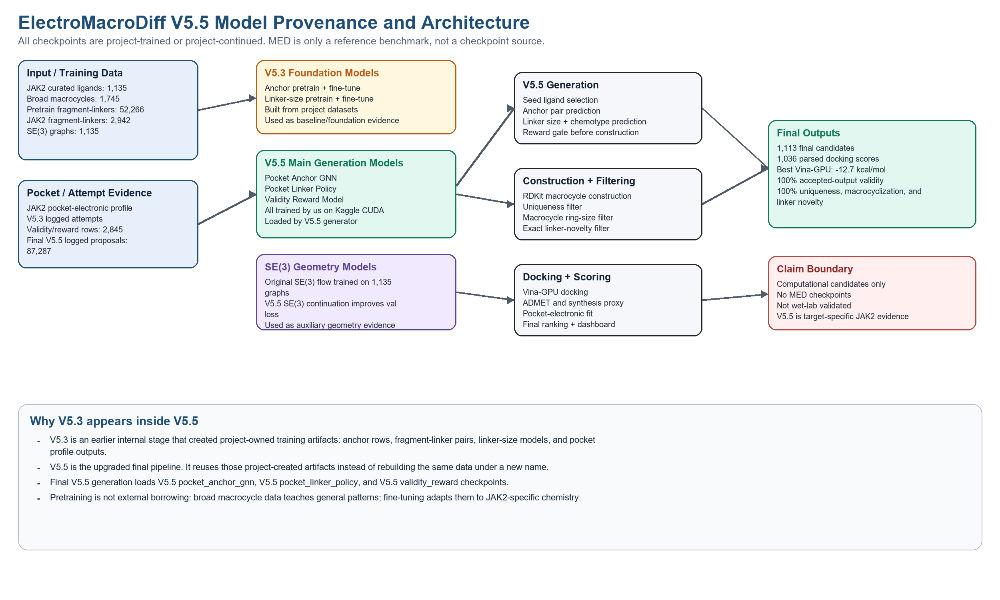
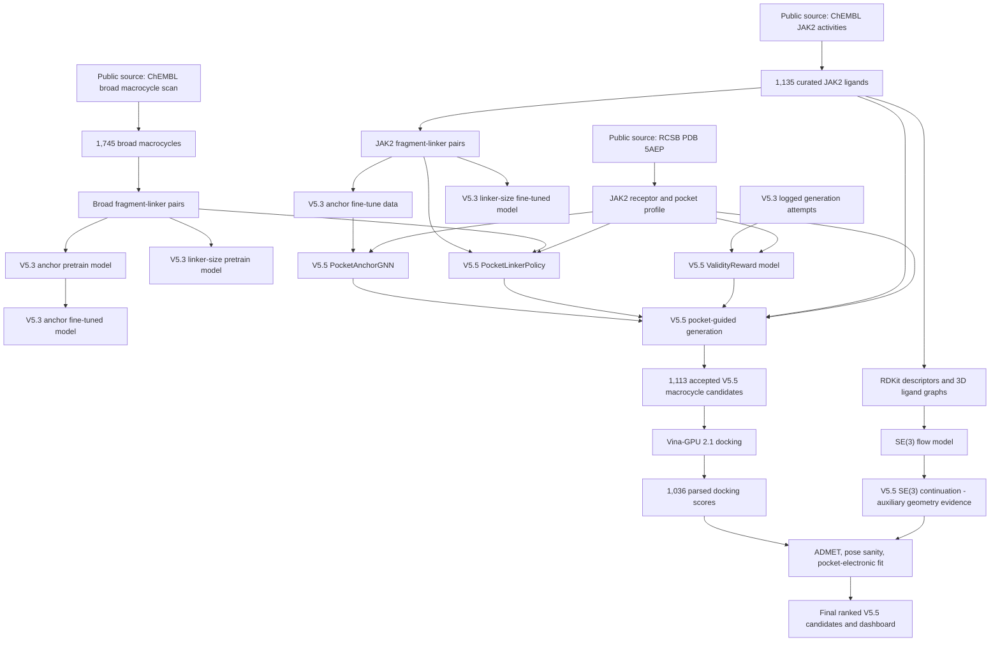

# ElectroMacroDiff V5.5 Senior Review Dossier

Project number: 1169

Audit date: 2026-05-29

Repository audited: `C:\Users\srira\Desktop\new_plan\EMD_V5_2_Hybrid`

This document is written for explaining the project to a senior reviewer or project coordinator. It answers the main questions about model origin, checkpoint provenance, datasets, training scale, metrics, overfitting, V5.3 versus V5.5 naming, and the final architecture. All numbers below are taken from local project CSV/JSON/checkpoint summaries in this repository.

## 1. One-page answer for sir

### Did we use any MED checkpoints?

No. We did not use MED model checkpoints.

MED was used only as a reference paper/benchmark comparison. The project does not contain a MED checkpoint path, and the final V5.5 generator loads only our project-trained checkpoints:

- `04_models_checkpoints/v5_5_pocket_anchor_gnn/pocket_anchor_gnn_best.pt`
- `04_models_checkpoints/v5_5_pocket_linker_policy/pocket_linker_policy_best.pt`
- `04_models_checkpoints/v5_5_validity_reward/validity_reward_best.pt`

The SE(3) continuation checkpoint is also our own continuation from our own earlier SE(3) checkpoint:

- `04_models_checkpoints/v5_5_se3_continuation/se3_v5_5_best_checkpoint.pt`

### Is everything trained by us?

Yes, the model weights in the final V5.5 branch are trained or continued by us from project data. The data comes from public scientific sources and project-generated logs:

- ChEMBL JAK2 activity records for ligand curation.
- ChEMBL broad macrocycle molecule scan for pretraining data.
- RCSB PDB structure `5AEP` for the JAK2 protein target.
- Our own V5.3/V5.5 generated attempt logs for validity/reward learning.
- Our own docking and pocket-electronic scoring outputs for final ranking.

### If some metrics are 100%, is that overfitting?

Not by itself. The 100% values are output-filter metrics, not model test accuracy.

For the final accepted V5.5 candidate CSV:

- uniqueness = 100% because all 1,113 accepted candidates have unique InChIKeys.
- macrocyclization = 100% because the final output filter only accepts macrocycles.
- linker novelty = 100% because exact known training linkers were rejected during generation and then measured again.

These are not neural-network accuracy metrics. The neural-network test metrics are lower and realistic:

- V5.5 PocketAnchorGNN test F1 = 0.484848.
- V5.5 PocketLinkerPolicy size exact accuracy = 0.592811 and within-one accuracy = 0.818065.
- V5.5 ValidityReward test ROC-AUC = 0.86049.
- V5.5 SE(3) continuation best validation loss improved from 9.062095 to 7.432842.

So the 100% values show strict filtering of the final delivered candidate set, not that the models memorized all training data.

### How many molecules/samples were trained?

The answer depends on the model:

| Training data/artifact | Molecules or samples used |
|---|---:|
| Raw ChEMBL JAK2 activity pull | 1,500 records, 1,197 unique canonical SMILES |
| Curated JAK2 ligand table | 1,135 unique ligands |
| SE(3) ligand graph training dataset | 1,135 graphs |
| Broad ChEMBL macrocycle pretraining set | 1,745 unique macrocycles |
| Broad fragment-linker pretraining rows | 52,266 fragment-linker pairs from 1,667 molecules |
| Broad anchor pretraining rows | 2,642,513 atom-level rows from 1,667 molecules |
| JAK2 fragment-linker fine-tuning rows | 2,942 fragment-linker pairs from 97 molecules |
| JAK2 anchor fine-tuning rows | 94,247 atom-level rows from 97 molecules |
| V5.5 linker policy training samples | 55,208 samples |
| V5.5 validity reward training samples | 2,845 attempt-log samples |
| Final V5.5 generation attempts | 87,287 logged attempts |
| Final V5.5 accepted candidates | 1,113 unique candidates |
| Final V5.5 docked/scored candidates | 1,036 Vina-GPU parsed scores |

### Why are V5.3 files used inside the V5.5 project?

V5.3 is an internal milestone, not an external model source. V5.3 created the foundation datasets and baseline checkpoints:

- anchor atom labels,
- fragment-linker pairs,
- broad macrocycle pretraining data,
- sidecar attempt logs,
- early model-guided generation outputs.

V5.5 is the latest final branch. It upgrades the V5.3 ligand-only foundation into a pocket-electronic-conditioned pipeline. Reusing V5.3 artifacts in V5.5 is normal project lineage, like using "phase 1" data inside a "phase 2" model. It does not mean the final version is older, and it does not mean any MED checkpoint was used.

### What is the final V5.5 claim?

Correct claim:

> ElectroMacroDiff V5.5 conditions anchor selection, linker choice, and validity gating on JAK2 pocket-electronic context during generation, then ranks generated macrocycles by Vina-GPU docking, ADMET proxies, pose sanity, and pocket-electronic fit.

Incorrect claim:

> ElectroMacroDiff V5.5 is a fully protein-conditioned diffusion model or experimentally validated drug discovery result.

The current system is computational and screening-stage only.

## 2. Architecture diagram

Static architecture image already generated:

Mermaid architecture for review:

## 3. End-to-end flow in short

Input to output:

1. Target selected: JAK2 protein, PDB `5AEP`.
2. Known ligand data collected from public ChEMBL JAK2 activity records.
3. Ligands curated into 1,135 unique JAK2 ligand entries.
4. Broad macrocycles collected from ChEMBL for pretraining.
5. Molecules converted into descriptors, 3D graphs, anchor atom rows, and fragment-linker pairs.
6. Foundation models trained:
   - SE(3) geometry model,
   - anchor-site model,
   - linker-size model.
7. V5.5 models trained:
   - PocketAnchorGNN,
   - PocketLinkerPolicy,
   - ValidityReward,
   - SE(3) continuation.
8. V5.5 generation uses JAK2 seeds plus JAK2 pocket-electronic profile during anchor selection, linker selection, and reward filtering.
9. Generated macrocycles are filtered for validity, uniqueness, macrocyclization, novelty, and basic chemistry.
10. Accepted candidates are docked into JAK2 using Vina-GPU 2.1.
11. Docked candidates are scored by docking score, ADMET/synthesis proxies, pose sanity, and pocket-electronic fit.
12. Final output is a ranked V5.5 candidate table and dashboard.

## 4. Data provenance

### Public data sources actually used in the current final V5.5 branch

| Source | What was used | How it was collected | Local evidence |
|---|---|---|---|
| ChEMBL activity API | Human JAK2 activity records, activity types IC50/Ki/Kd | `scripts/01_collect_data.py` calls `fetch_chembl_activities`; target query uses JAK2/`CHEMBL2971` logic in `src/emd_v5_2_hybrid/data_collection.py` | `01_raw_data/chembl/jak2_activities_raw.csv` |
| ChEMBL molecule API | Broad macrocycles for pretraining | `scripts/16_collect_macrocycle_pretraining_data.py` scans ChEMBL molecule records and selects macrocycles by ring-size criteria | `02_curated_data/v5_3_pretrain_macrocycles.csv` |
| RCSB PDB | JAK2 structure `5AEP` | `download_pdb("5AEP", ...)` downloads from RCSB | `01_raw_data/pdb/5AEP.pdb` |
| Project-generated V5.3 logs | Success/failure examples for reward model | V5.3 sidecar generation logs provide attempt statuses | `05_generated_candidates/model_guided_macrocycle/*attempt_log.csv` |
| Project-generated V5.5 logs | Final generation evidence | V5.5 generator logs every attempt and accepted output | `05_generated_candidates/v5_5_pocket_guided/v5_5_pocket_guided_attempt_log.csv` |
| Project-generated docking | Final Vina-GPU scores and pocket scoring | Vina-GPU 2.1 docking and local parsing/scoring | `06_docking/v5_5_pocket_guided/scores/*.csv` |

### Data sources not used in final V5.5 evidence

The repository has placeholder folders for future expansion:

- `01_raw_data/bindingdb/`
- `01_raw_data/pubchem/`
- `01_raw_data/literature/`

In the current audited workspace these folders contain no data files. Therefore, the final V5.5 evidence should not claim that BindingDB, PubChem, PDBbind, PLINDER, CrossDocked, or BioLiP2 were used for training. Those are planned V6 premium-dataset upgrades, not final V5.5 training evidence.

## 5. Dataset counts

| Artifact | Rows | Unique molecules or IDs | Purpose |
|---|---:|---:|---|
| `01_raw_data/chembl/jak2_activities_raw.csv` | 1,500 | 1,197 unique canonical SMILES | Raw JAK2 activity source |
| `02_curated_data/jak2_curated_ligands.csv` | 1,135 | 1,135 unique ligands | Main JAK2 ligand seed table |
| `02_curated_data/jak2_macrocycle_constrained.csv` | 1,135 | 1,135 unique ligands | Macrocycle/constrained ligand analysis table |
| `02_curated_data/v5_3_pretrain_macrocycles.csv` | 1,745 | 1,745 unique macrocycles | Broad macrocycle pretraining molecules |
| `02_curated_data/v5_3_pretrain_fragment_linker_pairs.csv` | 52,266 | 1,667 unique `mol_id` | Broad linker pretraining pairs |
| `02_curated_data/v5_3_macrocycle_fragment_linker_pairs.csv` | 2,942 | 97 unique `mol_id` | JAK2 fragment-linker fine-tuning pairs |
| `03_features/ligand_features.csv` | 1,135 | 1,135 unique ligands | RDKit descriptor features |
| `03_features/ligand_graphs/se3_graph_index.csv` | 1,135 | 1,135 graph entries | SE(3) graph dataset index |
| `03_features/v5_3_pretrain_anchor_atom_training.csv` | 2,642,513 | 1,667 unique `mol_id` | Broad atom-level anchor pretraining |
| `03_features/v5_3_anchor_atom_training.csv` | 94,247 | 97 unique `mol_id` | JAK2 atom-level anchor fine-tuning |
| `03_features/v5_5_validity_reward_training.csv` | 2,845 | 14 unique parent molecules | Attempt-log reward training |
| `05_generated_candidates/v5_5_pocket_guided/generated_v5_5_pocket_guided.csv` | 1,113 | 1,113 unique candidates | Final accepted V5.5 generated candidates |
| `05_generated_candidates/v5_5_pocket_guided/v5_5_pocket_guided_attempt_log.csv` | 87,287 | 250 seed parent molecules | Full logged generation attempts |
| `06_docking/v5_5_pocket_guided/scores/docking_scores_full_vina_gpu_2_1.csv` | 1,036 | 1,036 candidates | Parsed Vina-GPU docking scores |
| `08_final_ranking/v5_5_pocket_guided_pocket_electronic_ranked_candidates.csv` | 1,113 | 1,113 candidates | Final ranked candidate table |

## 6. Model and checkpoint provenance

### Total model groups

There are 9 relevant model/checkpoint groups in the project:

1. SE(3) flow model.
2. V5.3 anchor pretrain model.
3. V5.3 anchor fine-tuned model.
4. V5.3 linker-size pretrain model.
5. V5.3 linker-size fine-tuned model.
6. V5.5 PocketAnchorGNN.
7. V5.5 PocketLinkerPolicy.
8. V5.5 ValidityReward model.
9. V5.5 SE(3) continuation model.

### Model table

| # | Model | Where the model came from | Training data | Why it was used | Checkpoint |
|---:|---|---|---|---|---|
| 1 | SE(3) flow model | Trained by us in the project | 1,135 ligand graphs from curated JAK2 ligands | Learns 3D geometry/flow-matching signal; later used as foundation for auxiliary geometry evidence | `04_models_checkpoints/se3_flow/se3_best_checkpoint.pt` |
| 2 | V5.3 anchor pretrain model | Trained by us | 2,642,513 atom-level rows from broad ChEMBL macrocycles | Learns general macrocycle anchor-site patterns before JAK2 specialization | `04_models_checkpoints/v5_3_anchor_pretrain/anchor_site_model.pt` |
| 3 | V5.3 anchor fine-tuned model | Fine-tuned by us from our own V5.3 anchor pretrain checkpoint | 94,247 JAK2 atom-level rows | Specializes anchor prediction to JAK2 macrocycle data | `04_models_checkpoints/v5_3_anchor/anchor_site_model.pt` |
| 4 | V5.3 linker-size pretrain model | Trained by us | 52,266 broad ChEMBL macrocycle fragment-linker pairs | Learns general relationship between fragment context and linker size | `04_models_checkpoints/v5_3_linker_size_pretrain/linker_size_model.pt` |
| 5 | V5.3 linker-size fine-tuned model | Fine-tuned by us from our own V5.3 linker pretrain checkpoint | 2,942 JAK2 fragment-linker pairs | Specializes linker-size prediction to JAK2 fragment-linker examples | `04_models_checkpoints/v5_3_linker_size/linker_size_model.pt` |
| 6 | V5.5 PocketAnchorGNN | Trained by us on Kaggle GPU | JAK2 anchor rows and fragment graph labels plus 32-dimensional JAK2 pocket vector | Upgrades anchor selection from ligand-only MLP to graph plus pocket-electronic context | `04_models_checkpoints/v5_5_pocket_anchor_gnn/pocket_anchor_gnn_best.pt` |
| 7 | V5.5 PocketLinkerPolicy | Trained by us on Kaggle GPU | Combined broad/JAK2 fragment-linker samples plus 32-dimensional JAK2 pocket vector | Predicts linker length and chemotype with pocket context | `04_models_checkpoints/v5_5_pocket_linker_policy/pocket_linker_policy_best.pt` |
| 8 | V5.5 ValidityReward | Trained by us on Kaggle GPU | 2,845 project attempt-log examples plus 32-dimensional JAK2 pocket vector | Rejects low-quality attempts before expensive construction/docking | `04_models_checkpoints/v5_5_validity_reward/validity_reward_best.pt` |
| 9 | V5.5 SE(3) continuation | Continued by us from our own SE(3) flow checkpoint | Existing SE(3) graph tensors | Improves auxiliary geometry evidence; not the main molecule generator | `04_models_checkpoints/v5_5_se3_continuation/se3_v5_5_best_checkpoint.pt` |

## 7. Detailed model explanations

### 7.1 SE(3) flow model

Purpose:

- Model 3D molecular geometry behavior from ligand graphs.
- Provide geometry-learning evidence and later auxiliary scoring support.

Training evidence:

- Summary file: `04_models_checkpoints/se3_flow/training_summary.json`
- Total graphs: 1,135
- Train graphs: 794
- Validation graphs: 170
- Held-out test graphs: 171
- Epochs: 50
- Hidden dimension: 128
- Layers: 4
- Learning rate: 0.0002
- Best validation loss: 9.062095

Important explanation:

- This is our model checkpoint, not MED.
- In V5.5, SE(3) is auxiliary geometry evidence. It is not claimed as a full protein-conditioned diffusion generator.

### 7.2 V5.3 anchor pretrain model

Purpose:

- Predict which atoms are plausible macrocycle anchor/attachment atoms.
- Pretraining gives the model broad macrocycle chemistry before fine-tuning.

Training evidence:

- Summary file: `04_models_checkpoints/v5_3_anchor_pretrain/anchor_training_summary.json`
- Input: `03_features/v5_3_pretrain_anchor_atom_training.csv`
- Rows: 2,642,513
- Train rows: 1,985,544
- Validation rows: 389,995
- Test rows: 266,974
- Positive fraction: 0.039558
- Epochs: 1000
- Hidden dimension: 192
- Best epoch: 117
- Test F1: 0.169687

Why pretrain:

- Anchor positives are rare, so broad macrocycle pretraining gives more examples of atom-level macrocycle attachment patterns.
- This is similar to learning a general chemistry skill before adapting to JAK2.

### 7.3 V5.3 anchor fine-tuned model

Purpose:

- Adapt the general anchor model to JAK2 macrocycle fragment examples.

Training evidence:

- Summary file: `04_models_checkpoints/v5_3_anchor/anchor_training_summary.json`
- Input: `03_features/v5_3_anchor_atom_training.csv`
- Initialized from: `04_models_checkpoints/v5_3_anchor_pretrain/anchor_site_model.pt`
- Rows: 94,247
- Train rows: 69,505
- Validation rows: 14,788
- Test rows: 9,954
- Epochs: 500
- Best epoch: 369
- Test F1: 0.208901

Important explanation:

- This was the V5.3 baseline anchor model.
- It is kept for provenance and comparison.
- V5.5 improves on this idea using PocketAnchorGNN.

### 7.4 V5.3 linker-size pretrain model

Purpose:

- Predict linker size from fragment-linker context.
- Learn general macrocycle linker-size patterns from broad ChEMBL macrocycles.

Training evidence:

- Summary file: `04_models_checkpoints/v5_3_linker_size_pretrain/linker_size_training_summary.json`
- Input: `02_curated_data/v5_3_pretrain_fragment_linker_pairs.csv`
- Rows: 52,266
- Train rows: 39,252
- Validation rows: 7,791
- Test rows: 5,223
- Labels: linker sizes 3 to 12
- Epochs: 1000
- Best epoch: 994
- Test exact accuracy: 0.195673
- Test within-one accuracy: 0.407620
- Test MAE: 2.749186 atoms

What this model is:

- It is a broad pretraining model.
- It is not the final V5.5 linker policy.
- It exists because broad macrocycle data helps initialize/understand linker-size behavior before JAK2 specialization.

### 7.5 V5.3 linker-size fine-tuned model

Purpose:

- Specialize linker-size prediction to JAK2 fragment-linker examples.

Training evidence:

- Summary file: `04_models_checkpoints/v5_3_linker_size/linker_size_training_summary.json`
- Input: `02_curated_data/v5_3_macrocycle_fragment_linker_pairs.csv`
- Initialized from: `04_models_checkpoints/v5_3_linker_size_pretrain/linker_size_model.pt`
- Rows: 2,942
- Train rows: 2,146
- Validation rows: 485
- Test rows: 311
- Epochs: 500
- Best epoch: 491
- Test exact accuracy: 0.344051
- Test within-one accuracy: 0.623794
- Test MAE: 1.321543 atoms

What this model is:

- It is the JAK2-specialized V5.3 linker-size predictor.
- It explains the foundation lineage of the project.
- V5.5 replaces/extends this with a pocket-conditioned linker policy that predicts both size and chemotype.

### 7.6 V5.5 PocketAnchorGNN

Purpose:

- Select anchor atoms using graph context plus JAK2 pocket-electronic context.
- This directly addresses the project aim of pocket/electronic guidance during generation.

Architecture:

- Molecular graph node features: 64 dimensions.
- Pocket vector: 32 dimensions.
- Hidden dimension: 128.
- Graph model with message passing and per-atom output.

Training evidence:

- Summary file: `04_models_checkpoints/v5_5_pocket_anchor_gnn/pocket_anchor_gnn_training_summary.json`
- Anchor data: `03_features/v5_3_anchor_atom_training.csv`
- Fragment data: `02_curated_data/v5_3_macrocycle_fragment_linker_pairs.csv`
- Graphs: 97 total
- Train graphs: 72
- Validation graphs: 15
- Test graphs: 10
- Epochs trained: 573
- Best epoch: 373
- Best validation F1: 0.510204
- Test F1: 0.484848
- Test precision: 0.347826
- Test recall: 0.800000
- Test accuracy: 0.896024
- Device: Kaggle Tesla T4 CUDA

Why it matters:

- V5.3 anchor MLP saw mostly local atom features.
- V5.5 PocketAnchorGNN sees graph neighborhood structure and the JAK2 pocket vector.
- This is the main anchor model used by final V5.5 generation.

### 7.7 V5.5 PocketLinkerPolicy

Purpose:

- Predict linker length and chemotype with pocket context.
- This is where the system makes electron/pocket-aware linker decisions during generation.

Architecture:

- Linker feature input: 16 dimensions.
- Pocket vector input: 32 dimensions.
- Dual outputs:
  - linker size distribution,
  - chemotype distribution.

Training evidence:

- Summary file: `04_models_checkpoints/v5_5_pocket_linker_policy/pocket_linker_policy_training_summary.json`
- Total samples: 55,208
- Epochs trained: 1,112
- Best epoch: 862
- Best validation combined score: 0.792270
- Test size exact accuracy: 0.592811
- Test size within-one accuracy: 0.818065
- Test size MAE: 0.846267
- Test chemotype accuracy: 0.755023
- Device: Kaggle Tesla T4 CUDA

Why it matters:

- The earlier V5.3 model predicted only linker size.
- V5.5 predicts linker size and chemotype.
- This better supports the "electron-feature-guided generation" aim.

### 7.8 V5.5 ValidityReward model

Purpose:

- Predict whether a proposed generation attempt is likely to become a valid macrocycle.
- Reject very weak attempts before RDKit construction and docking.

Architecture:

- Attempt features: 19 dimensions.
- Pocket vector: 32 dimensions.
- Total input dimension: 51.
- Binary classifier for `P(valid macrocycle attempt)`.

Training evidence:

- Summary file: `04_models_checkpoints/v5_5_validity_reward/validity_reward_training_summary.json`
- Training file: `03_features/v5_5_validity_reward_training.csv`
- Total samples: 2,845
- Positive samples: 182
- Negative samples: 2,663
- Epochs trained: 331
- Best epoch: 31
- Best validation ROC-AUC: 0.963598
- Test ROC-AUC: 0.860490
- Test F1: 0.275862
- Test precision: 0.166667
- Test recall: 0.800000
- Test accuracy: 0.822535
- Device: Kaggle Tesla T4 CUDA

Important explanation:

- The reward model is intentionally strict.
- In final generation it rejected 78,257 low-quality attempts.
- Those rejected attempts are why strict raw-attempt validity appears low if every proposal is counted.

### 7.9 V5.5 SE(3) continuation

Purpose:

- Continue the original SE(3) geometry model training.
- Use it as auxiliary geometry evidence, not as the main generator.

Training evidence:

- Summary file: `04_models_checkpoints/v5_5_se3_continuation/se3_v5_5_training_summary.json`
- Initial checkpoint: `04_models_checkpoints/se3_flow/se3_best_checkpoint.pt`
- Initial validation loss: 9.062095
- Final epoch: 477
- Best epoch: 377
- Best validation loss: 7.432842
- Test loss: 8.823802
- Device: Kaggle Tesla T4 CUDA

Important explanation:

- This is continued from our own checkpoint.
- It does not come from MED.
- It supports geometry confidence but is not included as a false "protein-conditioned diffusion" claim.

## 8. Why pretraining and fine-tuning were used

Pretraining and fine-tuning were used because the JAK2-specific macrocycle dataset is small.

Broad macrocycle pretraining:

- uses larger ChEMBL macrocycle data,
- teaches general macrocycle patterns,
- reduces the chance that the model only sees a tiny JAK2 subset,
- gives better initialization for sparse anchor/linker tasks.

JAK2 fine-tuning:

- adapts the broad model to the actual target family and target pocket workflow,
- keeps the model relevant to the final JAK2 use case.

This is not the same as using someone else's pretrained checkpoint. The pretraining checkpoints are our own checkpoints trained from our own curated public-data pipeline.

## 9. Why V5.3 appears in a V5.5 project

V5.3, V5.4, and V5.5 are development milestones:

- V5.3 built the model-guided macrocycle foundation.
- V5.4 added pocket-electronic scoring as post-generation evidence.
- V5.5 added pocket-electronic conditioning during generation decisions.

Therefore, V5.5 reuses V5.3 foundation datasets:

- `v5_3_pretrain_anchor_atom_training.csv`
- `v5_3_anchor_atom_training.csv`
- `v5_3_pretrain_fragment_linker_pairs.csv`
- `v5_3_macrocycle_fragment_linker_pairs.csv`
- V5.3 logged attempt files for reward-model training.

This is correct lineage. The final branch is still V5.5 because the final generation script uses V5.5 pocket-conditioned models and writes V5.5 outputs.

## 10. Final V5.5 generation and filtering

Final generation evidence:

- Summary file: `05_generated_candidates/v5_5_pocket_guided/v5_5_pocket_guided_summary.json`
- Output CSV: `05_generated_candidates/v5_5_pocket_guided/generated_v5_5_pocket_guided.csv`
- Attempt log: `05_generated_candidates/v5_5_pocket_guided/v5_5_pocket_guided_attempt_log.csv`

Generation settings/evidence:

- Device: CUDA
- Total logged attempts: 87,287
- Valid accepted candidates: 1,113
- Reward threshold: 0.3
- Linker novelty enforced: true
- Fallback models allowed: false

Final loaded models:

- `v5_5_pocket_anchor_gnn/pocket_anchor_gnn_best.pt`
- `v5_5_pocket_linker_policy/pocket_linker_policy_best.pt`
- `v5_5_validity_reward/validity_reward_best.pt`

The generator fails if these V5.5 checkpoints are missing unless explicitly run with fallback enabled. That protects the final branch from silently using dummy models.

## 11. What are the 78,257 rejected samples?

They are not failed final molecules. They are pre-construction generation proposals rejected by the V5.5 ValidityReward model.

Final V5.5 attempt log status counts:

| Attempt status | Count | Meaning |
|---|---:|---|
| `rejected_by_reward_model` | 78,257 | Proposal was predicted as low-quality before construction |
| `rejected_known_linker` | 5,230 | Valid-looking macrocycle but linker exactly matched known training linker, so rejected for novelty |
| `filtered_non_macrocycle_or_basic_filters` | 2,108 | Constructed molecule did not satisfy macrocycle/basic chemistry filters |
| `valid_output` | 1,113 | Accepted final candidate |
| `duplicate_or_invalid_record` | 357 | Duplicate or invalid after candidate checks |
| `ring_closure_failed` | 221 | RDKit/linker construction failed to close the ring |
| `insufficient_anchors` | 1 | Seed did not provide enough usable anchors |

Why the number is large:

- V5.5 was run aggressively and logged every proposal.
- The reward model acts as a strict gate to prevent bad proposals from reaching construction/docking.
- Counting these rejected proposals in raw validity is conservative.

## 12. V5.5 metrics and what they mean

### Final accepted output metrics

From `generated_v5_5_pocket_guided_metrics.csv` and benchmark summaries:

| Metric | V5.5 value | Interpretation |
|---|---:|---|
| Accepted candidates | 1,113 | Final output molecules after all generation filters |
| Unique InChIKeys | 1,113 | All final candidates are unique |
| Uniqueness | 100.00% | Output-set uniqueness, not model accuracy |
| Macrocycle fraction | 100.00% | Final output filter accepted only macrocycles |
| Linker novelty | 100.00% | Exact training-linker matches were rejected |
| Basic filter pass fraction | 100.00% | Final output passed configured basic chemistry filters |
| Median MW | 497.646 | Descriptor statistic |
| Median logP | 4.3007 | Descriptor statistic |
| Median QED | 0.3913 | ADMET-like descriptor statistic |
| Median SA proxy | 4.77 | Synthesis proxy statistic |

### Validity definitions

There are three different validity numbers. They must not be mixed.

| Validity view | Formula | Value | Use |
|---|---|---:|---|
| Accepted-output validity | accepted output rows / accepted output rows | 100.00% | Describes the final delivered CSV after filtering |
| Chemistry-stage validity after reward gate | `(valid_output + rejected_known_linker) / attempts_after_reward_gate` = `(1,113 + 5,230) / 9,030` | 70.24% | Best explanation of chemical construction success after the learned gate |
| Strict raw-attempt final acceptance | `valid_output / all_logged_attempts` = `1,113 / 87,287` | 1.2751% | Conservative proposal-level number when reward-model rejections are counted |

The strict raw-attempt number is low because it counts 78,257 reward-model rejections as raw attempts. The 70.24% number answers the senior's question about why the chemistry is not actually as poor as 1.2751% suggests.

### Docking and final ranking metrics

From final V5.5 docking/ranking files:

| Metric | Value |
|---|---:|
| Candidates sent through final branch | 1,113 |
| Vina-GPU parsed scores | 1,036 |
| Best Vina-GPU score | -12.7 kcal/mol |
| Median Vina-GPU score | -8.4 kcal/mol |
| Best pocket-electronic fit score in current ranking CSV | 0.853507 |
| Median pocket-electronic fit score in current ranking CSV | 0.788762 |
| Top ranked candidate | `CAND_3688f8acdc` |
| Top ranked Vina score | -12.7 kcal/mol |
| Top ranked pocket fit | 0.810776 |
| Top ranked final score | 0.874199 |

## 13. MED comparison and fairness

MED was used as a benchmark reference, not as a checkpoint source.

What is comparable:

- Validity can be discussed only when attempt logging is clear.
- Uniqueness, macrocyclization, and linker novelty can be compared as output-set metrics, with the caveat that generation settings and sample sizes differ.

What is not directly identical:

- MED's model architecture and training data are different.
- MED's site-prediction/generation process is not reproduced exactly.
- Vina-GPU docking scores are not identical to CPU AutoDock Vina scores.
- EMD V5.5's 100% output metrics are from a strict final accepted set, not from all raw proposals.

Safe statement:

> We used MED as a reference benchmark table. We did not use MED checkpoints. Our metric names follow the same idea, but the full process is not exactly identical because EMD V5.5 has a different architecture, logging policy, filtering policy, and docking engine.

## 14. Is this overfitting?

The project has possible dataset-size limitations, but the 100% output metrics are not direct evidence of overfitting.

Reasons:

1. The neural test metrics are not 100%.
   - Anchor GNN test F1 = 0.484848.
   - Linker policy size exact accuracy = 0.592811.
   - Validity reward test ROC-AUC = 0.86049.

2. The 100% values are final filter outputs.
   - If the generator rejects non-macrocycles, the final accepted CSV can have 100% macrocycles.
   - If the generator rejects exact known linkers, the final accepted CSV can have 100% exact-linker novelty.

3. The final candidate set is larger than the old V5.3 branch.
   - V5.3 frozen branch: 114 candidates.
   - V5.5 final branch: 1,113 candidates.

4. There are held-out/test summaries in the model reports.
   - The project records train/validation/test splits in model summary JSON files.

Honest caveat:

> The project is still limited by dataset size, especially the JAK2-specific fragment-linker molecules used for some tasks. For a publication-grade V6, larger external datasets such as BindingDB, PDBbind, PLINDER, BioLiP2, or CrossDocked should be incorporated. They were not used in the final V5.5 evidence branch.

## 15. Code map: what each major file does

| File or module | Role |
|---|---|
| `scripts/01_collect_data.py` | Collects ChEMBL JAK2 activities and RCSB PDB `5AEP` |
| `src/emd_v5_2_hybrid/data_collection.py` | ChEMBL/RCSB API logic and curation |
| `scripts/02_build_features.py` | Builds ligand descriptors and graph inputs |
| `src/emd_v5_2_hybrid/features.py` | RDKit descriptors and dataset splitting utilities |
| `src/emd_v5_2_hybrid/se3_dataset.py` | Builds 3D molecular graph tensors |
| `src/emd_v5_2_hybrid/se3_flow.py` | SE(3)-style flow model implementation |
| `src/emd_v5_2_hybrid/train_se3.py` | SE(3) training/evaluation/checkpoint helpers |
| `scripts/03_train_se3_main.py` | Main SE(3) training script |
| `scripts/16_collect_macrocycle_pretraining_data.py` | Broad ChEMBL macrocycle collection for pretraining |
| `scripts/13_build_v5_3_fragment_dataset.py` | Builds fragment-linker and anchor atom training tables |
| `src/emd_v5_2_hybrid/macrocycle_fragmentation.py` | Macrocycle fragmentation and atom-label generation |
| `scripts/14_train_v5_3_anchor_model.py` | V5.3 anchor MLP pretrain/fine-tune |
| `scripts/15_train_v5_3_linker_size_model.py` | V5.3 linker-size MLP pretrain/fine-tune |
| `src/emd_v5_2_hybrid/pocket_features.py` | Converts JAK2 pocket profile into 32-dimensional pocket vector |
| `src/emd_v5_2_hybrid/pocket_anchor_gnn.py` | V5.5 pocket-conditioned anchor GNN |
| `src/emd_v5_2_hybrid/pocket_linker_policy.py` | V5.5 dual-head linker size and chemotype policy |
| `src/emd_v5_2_hybrid/validity_reward.py` | V5.5 validity/reward classifier |
| `scripts/24_build_v5_5_training_data.py` | Builds V5.5 training manifests and reward training data |
| `scripts/25_train_pocket_anchor_gnn.py` | Trains V5.5 PocketAnchorGNN |
| `scripts/26_train_pocket_linker_policy.py` | Trains V5.5 PocketLinkerPolicy |
| `scripts/27_train_validity_reward.py` | Trains V5.5 ValidityReward model |
| `scripts/28_train_se3_continuation.py` | Continues SE(3) training |
| `scripts/29_generate_v5_5_pocket_guided.py` | Final V5.5 pocket-guided generation |
| `scripts/30_prepare_v5_5_docking_inputs_parallel.py` | Prepares V5.5 docking inputs |
| `scripts/06_prepare_pdbqt.py` | Prepares receptor/ligand PDBQT files |
| `scripts/06_prepare_vina_gpu_ligands.py` | Sanitizes ligands for Vina-GPU |
| `scripts/34_parse_v5_5_vina_gpu_outputs.py` | Parses Vina-GPU docking output files |
| `src/emd_v5_2_hybrid/pocket_electronics.py` | Pocket-electronic scoring logic |
| `scripts/21_score_pocket_electronics.py` | Scores docking poses against pocket electronics |
| `scripts/07_rank_candidates.py` | Combines docking, ADMET, pose, novelty, and pocket scores |
| `src/emd_v5_2_hybrid/benchmarking.py` | Benchmark metric computations |
| `scripts/20_measure_v5_3_benchmark_gaps.py` | Linker novelty and raw attempt gap measurement |
| `interface/extract_data.py` | Exports real project data to dashboard `interface/data.js` |

## 16. Frequently asked questions

### Q1. Did we use MED checkpoints?

No. We used MED only as a reference benchmark. All checkpoints in the final V5.5 branch are project checkpoints.

### Q2. Did we use external pretrained models?

No external neural checkpoint is used for the final generator. The "pretrain" checkpoints are our own models trained on broad ChEMBL macrocycle data.

### Q3. Then why is it called pretraining?

Because the model is first trained on a broader macrocycle dataset, then fine-tuned on JAK2-specific data. It is pretraining inside our project, not importing someone else's model.

### Q4. Why does the latest V5.5 branch still mention V5.3?

V5.3 produced reusable foundation data and baseline models. V5.5 is the final upgraded branch that uses V5.5 pocket-conditioned models on top of those earlier project artifacts.

### Q5. How many molecules did we train on?

For ligand-level data, 1,135 curated JAK2 ligands and 1,745 broad ChEMBL macrocycles. For row-level supervised tasks, the largest table has 2,642,513 atom-level anchor rows.

### Q6. Why are some training rows much larger than molecule counts?

One molecule can produce many atom-level rows or many fragment-linker examples. For anchor training, every atom can become a training row, so 1,667 broad macrocycles produce 2,642,513 atom-level rows.

### Q7. What is the main V5.5 model?

There is no single model. V5.5 is a multi-model system:

- PocketAnchorGNN selects anchor atoms.
- PocketLinkerPolicy selects linker size and chemotype.
- ValidityReward rejects low-quality proposals.
- SE(3) continuation provides auxiliary geometry evidence.

### Q8. Where are molecules generated?

Final V5.5 molecules are generated by:

- `scripts/29_generate_v5_5_pocket_guided.py`

Final output file:

- `05_generated_candidates/v5_5_pocket_guided/generated_v5_5_pocket_guided.csv`

### Q9. Where are the final docking scores?

Final V5.5 docking score file:

- `06_docking/v5_5_pocket_guided/scores/docking_scores_full_vina_gpu_2_1.csv`

### Q10. Why are there 1,113 generated candidates but 1,036 docking scores?

The final generated candidate table has 1,113 accepted molecules. The Vina-GPU parsed docking output contains 1,036 successful parsed score rows. Some candidates may not have reached or parsed through the docking preparation/output stage.

### Q11. Is linker novelty truly 100%?

It is 100% by exact-linker matching against the training linker set used in the benchmark script. It does not mean the whole chemistry has never been seen anywhere in the world. It means no generated candidate's extracted linker exactly matched the known training linker set used by this project.

### Q12. Is uniqueness truly 100%?

Yes for the final accepted V5.5 output table: 1,113 candidates and 1,113 unique InChIKeys.

### Q13. Did we use the exact same metric process as MED?

Not exactly. We use MED-style metric names and compare to MED reference values, but the architecture, attempt logging, filtering, sample size, and docking engine differ. We should present it as a careful reference comparison, not a full reproduction of MED.

### Q14. What is the 70.24% number?

It is construction-stage validity after the reward gate:

`(1,113 accepted valid outputs + 5,230 valid-but-known-linker rejections) / 9,030 attempts after reward gate = 70.24%`.

It shows that after the reward model removes weak proposals, the remaining chemistry has much higher success than the strict all-proposal validity number.

### Q15. Why is strict raw-attempt validity only 1.2751%?

Because it includes all 87,287 logged proposals, including 78,257 rejected by the reward model before construction. This is a conservative proposal-level metric.

### Q16. Does V5.5 beat MED?

Safe answer:

- V5.5 matches/exceeds MED-style final accepted-output uniqueness, macrocyclization, and exact linker novelty in our project output table.
- V5.5 does not beat MED on strict raw-attempt validity.
- V5.5 should not be claimed as a full MED replacement.

### Q17. What is the main project contribution?

The contribution is a low-resource, reproducible JAK2 macrocycle generation and prioritization pipeline that conditions generation decisions on pocket-electronic context and integrates generation, docking, ADMET proxy scoring, pose sanity, pocket-electronic fit, and dashboard reporting.

### Q18. Is this experimentally validated?

No. These are computational candidates. Experimental synthesis, biochemical assay, and safety validation are future work.

### Q19. What is missing for V6?

V6 should incorporate larger protein-ligand datasets:

- BindingDB/ChEMBL JAK activity expansion,
- PDBbind refined/core,
- PLINDER or BioLiP2 residue-level interaction data,
- CrossDocked later for large pose data.

V6 should replace the current 32-dimensional global pocket vector with a learned residue-level protein-ligand interaction encoder.

### Q20. What should we say if asked about overfitting?

Say:

> The 100% values are not model accuracy; they are final accepted-output filter metrics. The real test metrics are lower and reported separately. The project still has dataset-size limitations, so we are not claiming experimental validation or full MED replacement. We are claiming a working pocket-electronic-conditioned computational pipeline with transparent logs and conservative metric definitions.

## 17. Short explanation for sir

Use this in conversation:

> Sir, we did not use MED checkpoints. MED was only used as a benchmark reference. All final V5.5 checkpoints were trained or continued by us from public ChEMBL/RCSB data and our own generated attempt logs. The word "pretrain" refers to our own broad ChEMBL macrocycle pretraining, then JAK2 fine-tuning. V5.3 appears inside V5.5 because V5.3 was our earlier internal foundation stage that produced anchor/linker datasets and baseline checkpoints. V5.5 is the latest branch because final generation uses V5.5 pocket-conditioned models: PocketAnchorGNN, PocketLinkerPolicy, and ValidityReward. The 100% uniqueness/macrocycle/linker-novelty values are final accepted-output filter metrics, not neural model accuracy, so they are not by themselves proof of overfitting. We also report realistic held-out test metrics for the models and strict raw-attempt validity separately.

## 18. Claim boundaries for the final report

Allowed claims:

- The project uses public ChEMBL and RCSB PDB data.
- The final V5.5 models are trained/continued by the team.
- V5.5 conditions generation decisions on JAK2 pocket-electronic context.
- V5.5 generated 1,113 unique, macrocyclic, exact-linker-novel candidates.
- V5.5 parsed 1,036 Vina-GPU docking scores.
- The best parsed Vina-GPU score is -12.7 kcal/mol.
- The best pocket-electronic fit score in the current ranking CSV is 0.853507.
- The top ranked candidate is `CAND_3688f8acdc`.

Not allowed claims:

- Do not say MED checkpoints were used.
- Do not say V5.5 is fully protein-conditioned diffusion.
- Do not say quantum electron density was calculated.
- Do not say the molecules are experimentally proven inhibitors.
- Do not say BindingDB/PDBbind/PLINDER/CrossDocked were used in final V5.5 training.
- Do not say EMD fully beats MED overall.

## 19. Evidence files to show if asked

| Evidence | File |
|---|---|
| Campaign config | `00_project_registry/campaign_config.yaml` |
| Raw ChEMBL pull | `01_raw_data/chembl/jak2_activities_raw.csv` |
| Curated JAK2 ligands | `02_curated_data/jak2_curated_ligands.csv` |
| Broad macrocycle data | `02_curated_data/v5_3_pretrain_macrocycles.csv` |
| Fragment-linker pretraining | `02_curated_data/v5_3_pretrain_fragment_linker_pairs.csv` |
| JAK2 fragment-linker data | `02_curated_data/v5_3_macrocycle_fragment_linker_pairs.csv` |
| Anchor pretraining rows | `03_features/v5_3_pretrain_anchor_atom_training.csv` |
| Anchor fine-tuning rows | `03_features/v5_3_anchor_atom_training.csv` |
| SE(3) summary | `04_models_checkpoints/se3_flow/training_summary.json` |
| V5.5 acceptance report | `04_models_checkpoints/v5_5_model_acceptance_report.json` |
| PocketAnchorGNN summary | `04_models_checkpoints/v5_5_pocket_anchor_gnn/pocket_anchor_gnn_training_summary.json` |
| PocketLinkerPolicy summary | `04_models_checkpoints/v5_5_pocket_linker_policy/pocket_linker_policy_training_summary.json` |
| ValidityReward summary | `04_models_checkpoints/v5_5_validity_reward/validity_reward_training_summary.json` |
| SE(3) continuation summary | `04_models_checkpoints/v5_5_se3_continuation/se3_v5_5_training_summary.json` |
| Final V5.5 generated candidates | `05_generated_candidates/v5_5_pocket_guided/generated_v5_5_pocket_guided.csv` |
| Final V5.5 attempt log | `05_generated_candidates/v5_5_pocket_guided/v5_5_pocket_guided_attempt_log.csv` |
| V5.5 benchmark gap summary | `05_generated_candidates/v5_5_pocket_guided/v5_5_pocket_guided_benchmark_gap_summary.json` |
| V5.5 docking scores | `06_docking/v5_5_pocket_guided/scores/docking_scores_full_vina_gpu_2_1.csv` |
| V5.5 final ranking | `08_final_ranking/v5_5_pocket_guided_pocket_electronic_ranked_candidates.csv` |

## 20. Final summary

ElectroMacroDiff V5.5 is the latest project branch. It does not use MED checkpoints. It uses public ChEMBL/RCSB data and project-generated logs to train a multi-model pocket-electronic-conditioned macrocycle generation pipeline for JAK2. V5.3 artifacts are present because they are earlier internal foundation artifacts used to build V5.5, not because the final branch is old. The final V5.5 branch generated 1,113 unique macrocyclic candidates, parsed 1,036 Vina-GPU docking scores, and produced a ranked candidate table with transparent metric definitions and claim boundaries.

