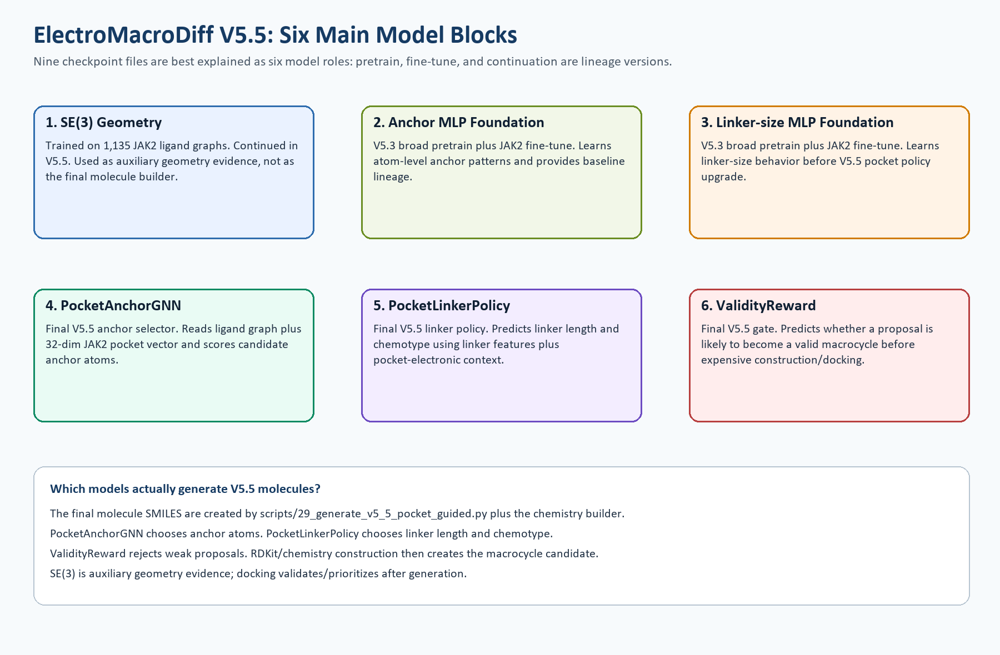
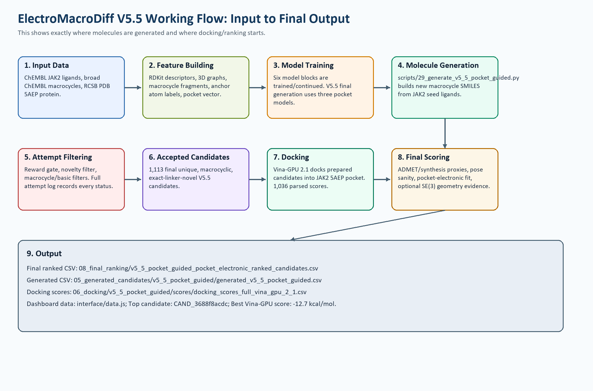

# ElectroMacroDiff V5.5 Working Flow and Six Main Models

Project number: 1169

Prepared from real project files in `C:\Users\srira\Desktop\new_plan\EMD_V5_2_Hybrid`.

## Quick answer

ElectroMacroDiff V5.5 is best explained as **six main model blocks**. The repository has more checkpoint files because some model blocks have pretrain, fine-tuned, or continuation versions.

The final V5.5 molecule generation happens in:

`scripts/29_generate_v5_5_pocket_guided.py`

The final generated molecules are written to:

`05_generated_candidates/v5_5_pocket_guided/generated_v5_5_pocket_guided.csv`

The models do not directly output a finished drug molecule in one single step. Instead, they guide a chemistry construction process:

1. choose seed ligand,
2. score/select anchor atoms,
3. choose linker length and chemotype,
4. build the macrocycle using the project chemistry builder,
5. reject weak/duplicate/non-novel/non-macrocycle attempts,
6. keep valid generated molecules,
7. dock and rank them.

## Six main model blocks

| # | Model block | Why it exists | Trained on | Used where |
|---:|---|---|---|---|
| 1 | SE(3) geometry model | Learns 3D geometry behavior and provides auxiliary geometry evidence | 1,135 JAK2 ligand graphs | SE(3) training/continuation and auxiliary geometry scoring |
| 2 | Anchor MLP foundation | Earlier foundation model for atom-level anchor prediction | 2,642,513 broad atom rows, then 94,247 JAK2 atom rows | V5.3 baseline/provenance, foundation for comparison |
| 3 | Linker-size MLP foundation | Earlier foundation model for linker-size prediction | 52,266 broad linker rows, then 2,942 JAK2 linker rows | V5.3 baseline/provenance, foundation for comparison |
| 4 | V5.5 PocketAnchorGNN | Selects anchor atoms using graph structure plus JAK2 pocket vector | JAK2 anchor graph labels plus 32-dim pocket vector | Final V5.5 generation |
| 5 | V5.5 PocketLinkerPolicy | Chooses linker size and chemotype using pocket-electronic context | 55,208 linker-policy samples | Final V5.5 generation |
| 6 | V5.5 ValidityReward | Rejects proposals likely to fail before construction/docking | 2,845 attempt-log samples | Final V5.5 generation gate |

## Input-to-output working flow

## Where exactly are molecules generated?

Molecules are generated in **Step 4: Molecule Generation**, inside:

`scripts/29_generate_v5_5_pocket_guided.py`

That script loads these final V5.5 checkpoints:

- `04_models_checkpoints/v5_5_pocket_anchor_gnn/pocket_anchor_gnn_best.pt`
- `04_models_checkpoints/v5_5_pocket_linker_policy/pocket_linker_policy_best.pt`
- `04_models_checkpoints/v5_5_validity_reward/validity_reward_best.pt`

Then it uses JAK2 seed ligands from the curated ChEMBL data. For each seed, it proposes anchor pairs and linker choices. The molecule is physically constructed by the project chemistry/linker construction code, not by docking and not by MED.

Important: docking starts **after** molecule generation. Docking does not generate the molecules. Docking only places the already-generated candidate into the JAK2 pocket and scores the pose.

## Final real outputs

| Output | Real value |
|---|---:|
| Final accepted V5.5 candidates | 1,113 |
| Unique final candidates | 1,113 |
| Final logged attempts | 87,287 |
| Reward-model rejections | 78,257 |
| Valid output rows | 1,113 |
| Vina-GPU parsed docking scores | 1,036 |
| Best Vina-GPU score | -12.7 kcal/mol |
| Median Vina-GPU score | -8.4 kcal/mol |
| Top ranked candidate | CAND_3688f8acdc |

## Short explanation for sir

Sir, the latest version is V5.5. We can explain it as six model blocks. The older V5.3 names appear because those were our internal foundation/pretraining datasets and checkpoints. The final V5.5 molecules are generated by `scripts/29_generate_v5_5_pocket_guided.py`, using V5.5 PocketAnchorGNN, PocketLinkerPolicy, and ValidityReward checkpoints. Molecules are first generated as macrocycle candidates, then Vina-GPU docking and pocket-electronic scoring are used only for validation and ranking.
